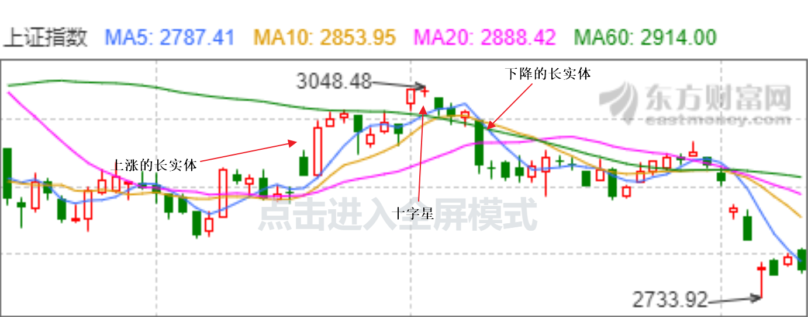
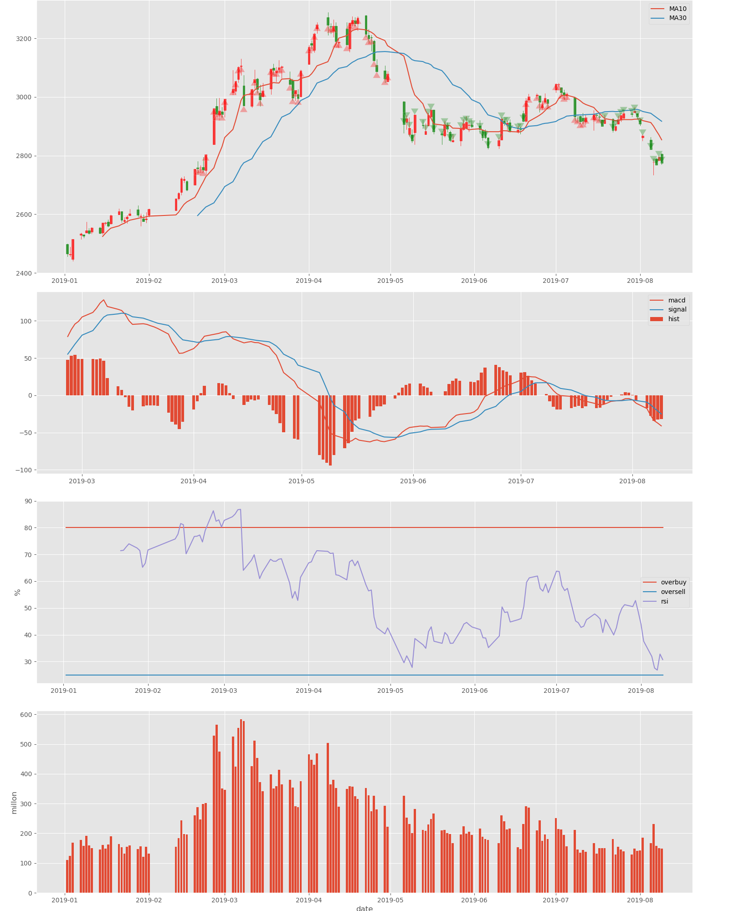

# 一个完整的量化交易策略
一个完整的量化交易策略指考虑到交易的方方面面，但是能不能赚钱，谁知道呢 :)

但是一个量化交易可以通过回测系统建立信心然后让其一如既往的运行，以达到让钱生钱的目的，并且是自动的。

笔者主要谈纯技术面的量化交易，基本面的一些情况并不好处理及量化，我也暂时没有涉及。

## 量化交易
一个完整的量化交易策略，个人觉得应该包含以下两个部分:
- 交易策略
- 资金管理

## 交易策略
一个完整的交易策略应该包含何时买，何时卖。

到底应该如何买卖，市场上大致分为两个技术流派。
- 趋势跟随
- 价值回归

### 趋势跟随
这个流派认为，股票的走势是有延续性的，所以买卖点的机会在于抓住走势。

代表指标: MACD, 移动平均线。
> 评语: 半年不开张，开张吃半年。

### 价值回归
这个流派认为，股票是有内在价值的，虽然无序的来回跳动，但是自始至终围绕着自己的内在价值来回波动，所以买卖的机会抓住股票的超买，超卖点来进行买卖。

代表指标: RSI。
> 评语: 积少成多。

无论是趋势跟随还是价值回归，其实还是没有解决买卖的最核心的问题，即到底何时买卖，虽然每个流派都有它的解决方案，但是它的方案却是抛出了一个新的问题来解决我们要解决的问题。

不过这些问题是存在一些技术指标来辅助我们观察走势以及超买超卖的。

## 技术指标
这里主要讨论一下常用的技术指标，比如MACD, 均线, RSI.除此之外还有一些有意思的图形指标,通过判断图表的形状来判断买卖，而图形派是既能做趋势跟随也能做价值回归

下面是它们的计算公式及介绍。

MACD
> MACD称为异同移动平均线，是从双指数移动平均线发展而来的，由快的指数移动平均线（EMA12）减去慢的指数移动平均线（EMA26）得到快线DIF，再用2×（快线DIF-DIF的9日加权移动均线DEA）得到MACD柱。--- 摘自百度百科

这个指标的快线DIF是是两个指数平均线的差，所以当走势上扬的时候，会是正数，而上扬的曲率很大的时候则也会迅速变大，而它的DEA自然是在其下方，而趋势向下的时候相反。所以这个指标可以反映出历史的走势，并且过滤一部分并没有明显趋势的走势，但是如果没有明显走势则是交叉死叉来回纠缠，对于局势的判断就不太明显。

移动平均线
> 移动平均线，Moving Average，简称MA，MA是用统计分析的方法，将一定时期内的证券价格（指数）加以平均，并把不同时间的平均值连接起来，形成一根MA，用以观察证券价格变动趋势的一种技术指标。--- 摘自百度百科

移动平均线应该是应用最广泛的技术指标了，因为几乎所有的交易软件都会绘制移动平均线，它就是反应了历史的趋势，走势向上则向上，反之亦然。

> N日RSI =N日内收盘涨幅的平均值/(N日内收盘涨幅均值+N日内收盘跌幅均值) × 100 --- 摘自百度百科

RSI很有意思，如果N日内全是上涨则是100，全是下跌则是0，所以100代表市场太乐观，0代表市场太悲观，这在走势震荡的时候自然有用，但是如果就是走势一路上扬，那么其实不是太乐观，而是市场就是如此，这个时候不应该反向操作。

蜡烛图
> 即我们熟悉的K线图，通过开盘价，最高价，最低价，表示一个时间周期的交易情况，蜡烛图有许多的有意义图形，这里主要说几个我觉得有点道理的图形，长实体，十字星

长实体指单根k线的最高价与最低价相差很大，然后收盘价与开盘价分别非常靠近最高价最低价。之所以这样是因为买方或者卖方非常强势。可以用来推测后面的走势，可用作趋势跟随。

十字星指开盘价与收盘价的差距非常小，几乎重合，然后有一部分的影线。之所以这样是因为买方卖方反复纠缠，却谁又干不过谁，可以用来推测局势的反转，可用作价值回归。

最近的上证指数很有意思，这两个图形啥都有。




所有技术指标都有其内在的含义，通过观察它的计算公式就知道，而且所有技术指标都存在一样的问题，那就是滞后性，或者说只是反映了历史的走势，不过，这是理所应当的，未来还未来。如果哪个指标可以预测未来，这个未来就太没意思了。

总结而言，无论是主观交易还是通过技术指标判断而进行交易，最终的判断在于决策者的经验，这个经验也许可以量化也许不可以量化。可以量化自然是最好的，不可以量化那也没问题，只要能挣钱不就够了嘛，不过是手动跟自动的区别。

## 可视化
多说无益，让我们看看这些指标的买卖情况吧。
> 这里使用上证指数

```
import matplotlib.pyplot as plt
import matplotlib as mpl
import pandas as pd
import talib
import tushare as ts
# pip install https://github.com/matplotlib/mpl_finance/archive/master.zip
from mpl_finance import candlestick_ohlc
from matplotlib.pylab import date2num

# 使用ggplot样式，好看些
mpl.style.use("ggplot")
# 获取上证指数数据
data = ts.get_k_data("000001", index=True, start="2019-01-01")
# 将date值转换为datetime类型，并且设置成index
data.date = pd.to_datetime(data.date)
data.index = data.date


# 计算MACD指标数据
data["macd"], data["sigal"], data["hist"] = talib.MACD(data.close)

# 计算移动平均线
data["ma10"] = talib.MA(data.close, timeperiod=10)
data["ma30"] = talib.MA(data.close, timeperiod=30)

# 计算RSI
data["rsi"] = talib.RSI(data.close)


# 计算MACD指标数据
data["macd"], data["sigal"], data["hist"] = talib.MACD(data.close)

# 计算移动平均线
data["ma10"] = talib.MA(data.close, timeperiod=10)
data["ma30"] = talib.MA(data.close, timeperiod=30)

# 计算RSI
data["rsi"] = talib.RSI(data.close)


# 绘制第一个图
fig = plt.figure()
fig.set_size_inches((16, 20))

ax_canddle = fig.add_axes((0, 0.7, 1, 0.3))
ax_macd = fig.add_axes((0, 0.45, 1, 0.2))
ax_rsi = fig.add_axes((0, 0.23, 1, 0.2))
ax_vol = fig.add_axes((0, 0, 1, 0.2))

data_list = []
for date, row in data[["open", "high", "low", "close"]].iterrows():
    t = date2num(date)
    open, high, low, close = row[:]
    datas = (t, open, high, low, close)
    data_list.append(datas)

# 绘制蜡烛图
candlestick_ohlc(ax_canddle, data_list, colorup='r', colordown='green', alpha=0.7, width=0.8)
# 将x轴设置为时间类型
ax_canddle.xaxis_date()
ax_canddle.plot(data.index, data.ma10, label="MA10")
ax_canddle.plot(data.index, data.ma30, label="MA30")
ax_canddle.legend()

# 绘制MACD
ax_macd.plot(data.index, data["macd"], label="macd")
ax_macd.plot(data.index, data["sigal"], label="sigal")
ax_macd.bar(data.index, data["hist"] * 2, label="hist")
ax_macd.legend()

# 绘制RSI
# 超过85%设置为超买, 超过25%为超卖
ax_rsi.plot(data.index, [80] * len(data.index), label="overbuy")
ax_rsi.plot(data.index, [25] * len(data.index), label="oversell")
ax_rsi.plot(data.index, data.rsi, label="rsi")
ax_rsi.set_ylabel("%")
ax_rsi.legend()

# 将volume除以100w
ax_vol.bar(data.index, data.volume / 1000000)
# 设置成百万位单位
ax_vol.set_ylabel("millon")
ax_vol.set_xlabel("date")
fig.savefig("index.png")

# 标记移动平均线买入卖出点
for date, point in data[["ma_point"]].itertuples():
    if math.isnan(point):
        continue
    if point > 0:
        ax_canddle.annotate("",
                    xy=(date, data.loc[date].close),
                    xytext=(date, data.loc[date].close - 10),
                    arrowprops=dict(facecolor="r",
                                    alpha=0.3,
                                    headlength=10,
                                    width=10))
    elif point < 0:
        ax_canddle.annotate("",
                    xy=(date, data.loc[date].close),
                    xytext=(date, data.loc[date].close + 10),
                    arrowprops=dict(facecolor="g",
                                    alpha=0.3,
                                    headlength=10,
                                    width=10))
        

```
> 如果通过pip install ta-lib安装不上，可以通过地址http://www.lfd.uci.edu/~gohlke/pythonlibs/#ta-lib下载响应的.whl包进行安装


显示结果如下:




如果简单的通过指标的金叉死叉会出现反常多的买点卖点，所以这里只是标记了移动平均线的买卖点。

> 通过简单观察我们发现RSI在这段时间内没有超卖的情况也就没有买入点。

## 总结
没有万能的指标，关键在于使用指标的人。


