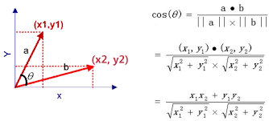
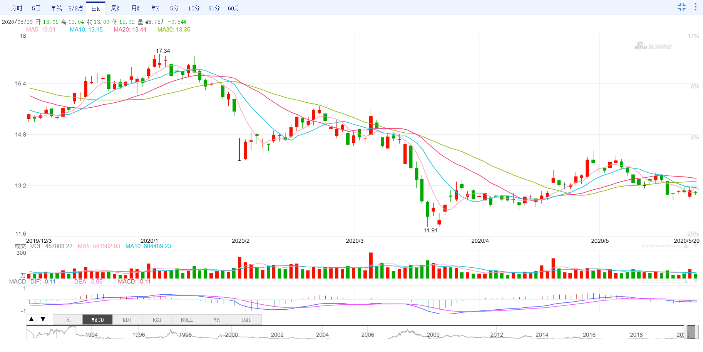
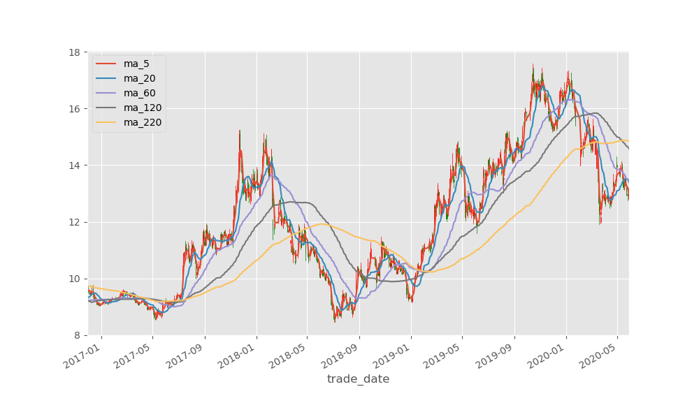
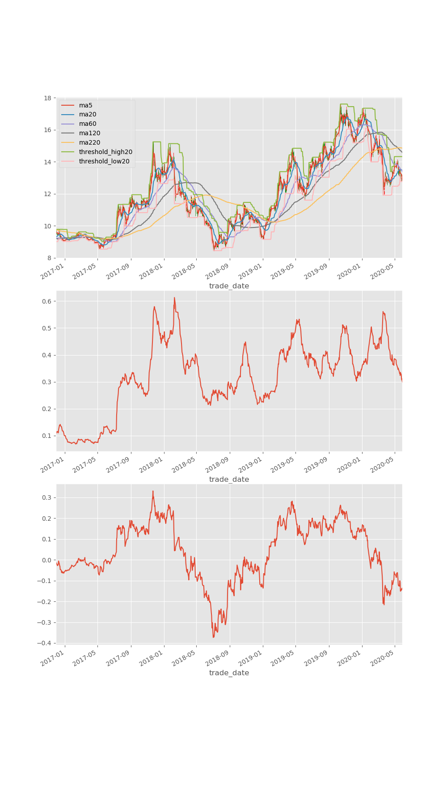

> 吾生也有涯，而知也无涯。以有涯随无涯，殆已！


> 入市有风险，投资需谨慎，本文不作为任何投资参考依据。


前面通过形态和一些基本面的数据进行了选股，这篇文章就来研究一下相似度选股以及趋势选股吧。

### 相似度
我们一般比较在意股票的收盘价，比如均线或者各种指标如果需要计算一段序列值，我们一般选择收盘价作为序列中的值，就像5日均线计算的是五日的收盘价的均值一样。

那么每天的收盘价就是一个个数字，一年的收盘价就是一串大概220个数字的序列，这个序列在数学上我们可以用向量来表示，而向量与向量之间是可以计算余弦相似度的，通过这个相似度计算我们可以比较一下两支股票的相似程度。

> 余弦相似度的值在-1与1之间，越相似就越接近1，反之越接近-1.

它的公式如下:



假设我们对对一支股票很熟悉，那么和它走势极其相似的股票我们是不是可以认为会在以后也跟我们熟悉的那支股票大概一致呢？或者说，在某个特定的行情下，在手动选出了我认为有利的趋势股票，在通过相似度找到其他的股票或许是件不错的事。

这里研究一下最近一百个交易日内与平安银行(000001)这只股票最相似的前十只股票。

为了避免交易日范围相差太大的情况，比如虽然都是最近100个交易日，但是被计算的股票已经停牌了10个交易日或者它没有上市超过10个交易日，所以应该将这些情况给筛选掉。

还有就是股票之间的价格差距过大，那么通过两只股票的价格来进行相似度比较显然不够合理，所以这里选择股票的涨幅大小来进行相似度比较。

```
# 计算余弦相似度的函数
def cos(vector_a, vector_b):
    vector_a = np.mat(vector_a)
    vector_b = np.mat(vector_b)
    num = float(vector_a * vector_b.T)
    denom = np.linalg.norm(vector_a) * np.linalg.norm(vector_b)
    cos = num / denom
    return cos
    
def select_by_similarity(data_path, code_name, top_size=10):
    day_range = 100
    # 交易日的起始截至时间做大不能超过这个间隔
    max_delta = timedelta(days=7)

    all_df = load_all_local_data(data_path, tail_size=day_range)
    # code_name = "000001.SZ"
    if code_name not in all_df:
        print("要比对的股票不在当前下载的股票数据中")

    vector_a = all_df[code_name].pct_chg
    start_date_a = vector_a.index[0]
    end_date_a = vector_a.index[-1]

    ret = []
    for ts_code, df in all_df.items():
        if ts_code == code_name:
            continue

        if len(df) < 100:
            print("股票[%s]交易日不足%s" % (ts_code, day_range))
            continue

        vector_b = df.pct_chg
        start_date_b = vector_b.index[0]
        end_date_b = vector_b.index[-1]

        # 计算开始结束交易日之间的时间间隔
        start_delta = abs(start_date_a - start_date_b)
        end_delta = abs(end_date_a - end_date_b)
        if start_delta > max_delta or end_delta > max_delta:
            print("股票[%s]与股票[%s]交易日间隔过大!" % (ts_code, code_name))
            continue

        cos_similarity = cos(vector_a, vector_b)
        ret.append((ts_code, cos_similarity))

    ret.sort(key=lambda x:x[1])
    print("相似度前%s的结果如下" % top_size)
    print(ret[-top_size:])

    print("最不相似的股票前%s的结果如下:" % top_size)
    print(ret[:top_size])
    return ret[-top_size:]
```
结果如下:

```
相似度前10的结果如下
[('601838.SH', 0.8413642902505222), ('600036.SH', 0.8435001924441485), ('601169.SH', 0.8446885175520177), ('600016.SH', 0.8460465823734755), ('601009.SH', 0.8472997719986147), ('601336.SH', 0.8493514488651387), ('601998.SH', 0.8501435442736384), ('601318.SH', 0.8515548626391685), ('601997.SH', 0.8723615980483687), ('601166.SH', 0.8951643562949727)]
最不相似的股票前10的结果如下:
[('600179.SH', -0.28209061607471647), ('002107.SZ', -0.2760541800360499), ('600630.SH', -0.2698469313704402), ('000790.SZ', -0.25063912833911006), ('002950.SZ', -0.24371742830236853), ('601718.SH', -0.24320952954633515), ('002603.SZ', -0.23229949296048), ('002022.SZ', -0.2298724102455836), ('688399.SH', -0.22925118956499124), ('688068.SH', -0.2222771289248757)]
```
可以发现最相似的是601838(成都银行)。

两只股票最近的走势如下




> 数据来自新浪财经

可以发现，虽然价格不同，但是相似度无论是通过计算公式计算还是人眼观察都有比较强的相似度的。


### 趋势选股
世上指标千千万，独爱均线，

首先，我们谁都不能预测未来，那么各种指标都是滞后的，均线也不例外，我们能看到的只有过去跟现在，既然如此就简单点吧，那些计算如此复杂的指标真的能比均线看的远一些么？

关于均线还有一些衍生的玩法，比如不同频率的均线的密集程度来判断趋势的启动与结束，以及股价与均线的差异值来判断股价的偏离程度，也是因为这些衍生的玩法，让我觉得对于一个想做趋势交易的我觉得，均线于我而言，远远足够了。

通过均线的密集程度判断趋势的开端。

> 而后面趋势是涨还是跌，谁知道呢。

```
def select_by_trend(data_path, code_name, ma_lst=None):
    fp = path.join(data_path, ("%s-.csv" % code_name))
    if not path.exists(fp):
        print("股票[%s]不存在本地数据" % code_name)
 
    df = pd.read_csv(fp, index_col="trade_date", parse_dates=["trade_date"])
    ohlc_columns = ["open", "high", "low", "close"]
    df = df[ohlc_columns]

    if ma_lst is None:
        ma_lst = [5, 20, 60, 120, 220]
        
    max_ma = max(ma_lst)
    ma_name_lst = []
    for ma in ma_lst:
        ma_name = "ma_%s" % ma
        ma_name_lst.append(ma_name)
        df[ma_name] = df.close.rolling(ma).mean()

    # 设置图片大小
    plt.figure(figsize=(10,6))

    # 过滤掉没有最长均线数据的交易日
    df2 = df.iloc[max_ma:]

    # 绘制k线图
    ax = ohlc_plot(df2[ohlc_columns])

    # 绘制均线图
    df2[ma_name_lst].plot(ax=ax)
    plt.savefig("ma.png")
    plt.show()
```

结果如下:



下面是本人用于分析的基本图表，仅供参考。也欢迎讨论。
代码如下:
```
def select_by_nobody(data_path, code_name, ma_lst=None, threshold=20, atr_period=14, diff_ma=20):
    fp = path.join(data_path, ("%s-.csv" % code_name))
    if not path.exists(fp):
        print("股票[%s]不存在本地数据" % code_name)
 
    df = pd.read_csv(fp, index_col="trade_date", parse_dates=["trade_date"])
    ohlc_columns = ["open", "high", "low", "close"]
    df = df[ohlc_columns]

    if ma_lst is None:
        ma_lst = [5, 20, 60, 120, 220]
        
    max_ma = max(ma_lst)
    # 计算均线
    ma_name_lst = []
    for ma in ma_lst:
        ma_name = "ma%s" % ma
        ma_name_lst.append(ma_name)
        df[ma_name] = df.close.rolling(ma).mean()

    # 默认以20日最高价作为上突破阈值, 20日最低价作为下突破阈值
    threshold_high_name = "threshold_high%s" % threshold
    threshold_low_name = "threshold_low%s" % threshold
    df[threshold_high_name] = df.high.rolling(threshold).max()
    df[threshold_low_name] = df.low.rolling(threshold).min()


    # 默认atr的计算时间范围是14天
    # talib一般通过包装好的whl包安装
    # 参考: https://www.lfd.uci.edu/~gohlke/pythonlibs/
    import talib
    atr_name = "atr%s" % atr_period
    df[atr_name] = talib.ATR(df.high, df.low, df.close, atr_period)

    # 默认计算乖离率收盘价与20日均线的差值, 然后将这个差值比上收盘价, 这个值被称为乖离率
    # 通过乖离率可以观察收盘价与均值之间的差异，差异越大则可能回弹的概率比较大
    if diff_ma not in ma_lst:
        ma_name = "ma%s" % diff_ma
        df[ma_name] = df.close.rolling(ma).mean()

    diff_name = "diff%s" % diff_ma
    df[diff_name] = (df["close"] - df[ma_name]) / df["close"]

    # 设置图片大小
    plt.figure(figsize=(10,18))

    # 配置子图
    ax1 = plt.subplot(311)
    ax2 = plt.subplot(312)
    ax3 = plt.subplot(313)

    # 过滤掉没有最长均线数据的交易日
    df2 = df.iloc[max_ma:]

    # 绘制k线图
    ohlc_plot(df2[ohlc_columns], ax1)

    # 绘制均线图
    df2[ma_name_lst].plot(ax=ax1)

    # 绘制上下最高最低突破线
    df2[[threshold_high_name, threshold_low_name]].plot(ax=ax1)

    # 绘制atr
    df2[atr_name].plot(ax=ax2)

    # 绘制乖离率
    df2[diff_name].plot(ax=ax3)

    plt.savefig("nobody.png")
    plt.show()
```

结果如下:




> 代码里面用了talib, 大家如果pip安装不了, 就去https://www.lfd.uci.edu/~gohlke/pythonlibs/下载对应的安装包吧。


## 源代码
https://github.com/youerning/blog/tree/master/stock_pool

如果期待后续文章可以关注我的微信公众号(又耳笔记)，头条号(又耳笔记)，Github(youerning).


## 总结
这里简单介绍了一下我暂时所能囊括的4中选股方法，如果大家还有别的看法欢迎在评论中与我讨论。

值得说明的是，我并不期望通过编程就能随随便便的从股市中赚钱，只是人的精力有限，本人又比较懒，那么让程序来完成一些我能通过程序描述的选股方法那么何乐而不为呢。
